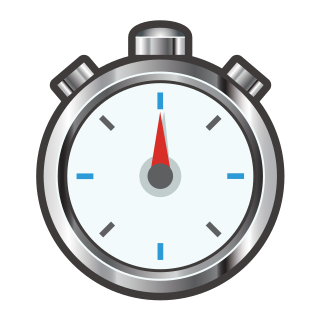

<div align="center">



# format-duration

Convert a number in milliseconds to a standard duration string.

[![npm][npm-image]][npm-url]
[![build][build-image]][build-url]
[![downloads][downloads-image]][npm-url]

[npm-image]: https://img.shields.io/npm/v/format-duration.svg
[npm-url]: https://www.npmjs.com/package/format-duration
[build-image]: https://github.com/ungoldman/format-duration/actions/workflows/tests.yml/badge.svg
[build-url]: https://github.com/ungoldman/format-duration/actions/workflows/tests.yml
[downloads-image]: https://img.shields.io/npm/dm/format-duration.svg

</div>

## Install

```
npm install format-duration
```

## Usage

```js
const format = require('format-duration')

// anything under a second is rounded down to zero
format(999) // '0:00'

// 1000 milliseconds is a second
format(1000) // '0:01'

// 1999 rounds down to 0:01
format(1000 * 2 - 1) // '0:01'

// 60 seconds is a minute
format(1000 * 60) // '1:00'

// 59 seconds looks like this
format(1000 * 60 - 1) // '0:59'

// 60 minutes is an hour
format(1000 * 60 * 60) // '1:00:00'

// 59 minutes and 59 seconds looks like this
format(1000 * 60 * 60 - 1) // '59:59'

// 24 hours is a day
format(1000 * 60 * 60 * 24) // '1:00:00:00'

// 23 hours, 59 minutes, and 59 seconds looks like this
format(1000 * 60 * 60 * 24 - 1) // '23:59:59'

// 365 days looks like this (not bothering with years)
format(1000 * 60 * 60 * 24 * 365) // '365:00:00:00'

// anything under a second is rounded down to zero
format(-999) // '0:00'

// 1000 milliseconds is a second
format(-1000) // '-0:01'

// 365 days looks like this (not bothering with years)
format(-1000 * 60 * 60 * 24 * 365) // '-365:00:00:00'

// with `leading` option, formatting looks like this
format(1000 * 60, { leading: true }) // '01:00'
format(1000 * 60 - 1, { leading: true }) // '00:59'
format(1000 * 60 * 60, { leading: true }) // '01:00:00'

// with `ms` option, formatting looks like this
format(999, { ms: true }) // '0:00.999'
format(1000 * 60, { ms: true }) // '1:00.000'
format(1000 * 60 * 60 * 24 - 1, { ms: true }) // '23:59:59.999'
```

## Contributing

Contributions welcome! Please read the [contributing guidelines](CONTRIBUTING.md) first.

## License

[ISC](LICENSE.md)

Stopwatch image is from [emojidex](https://emojidex.com/emoji/stopwatch).
